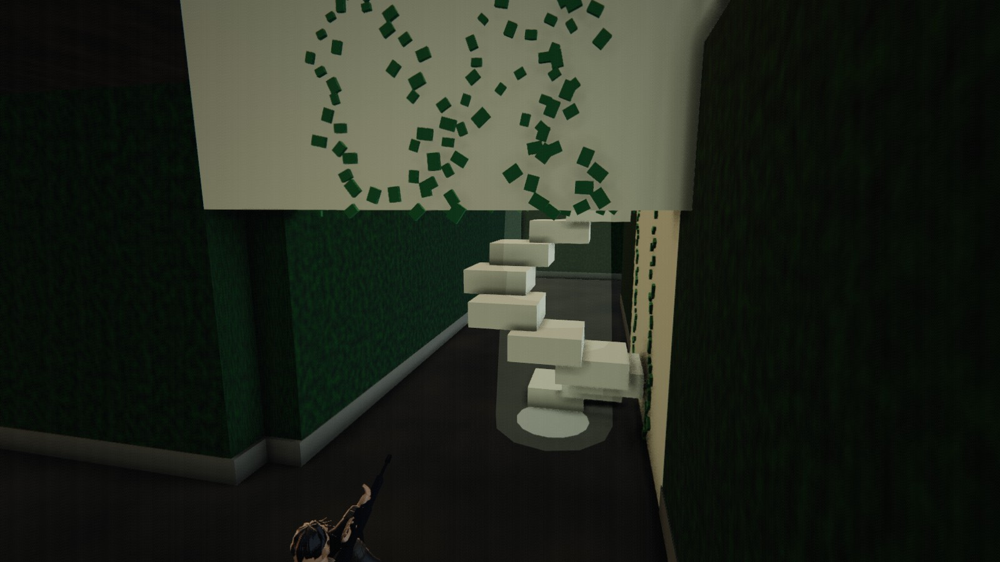
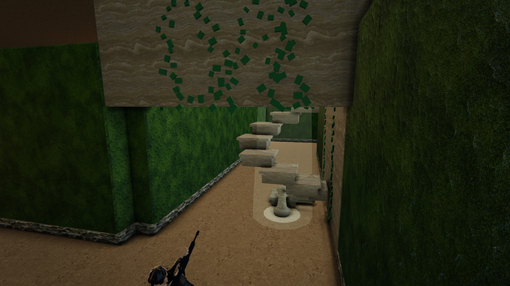
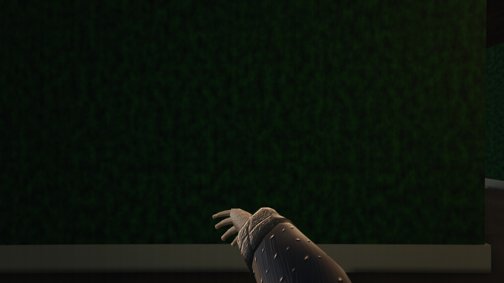
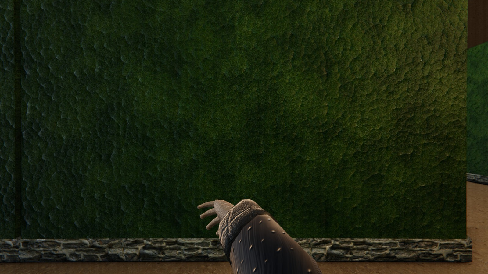
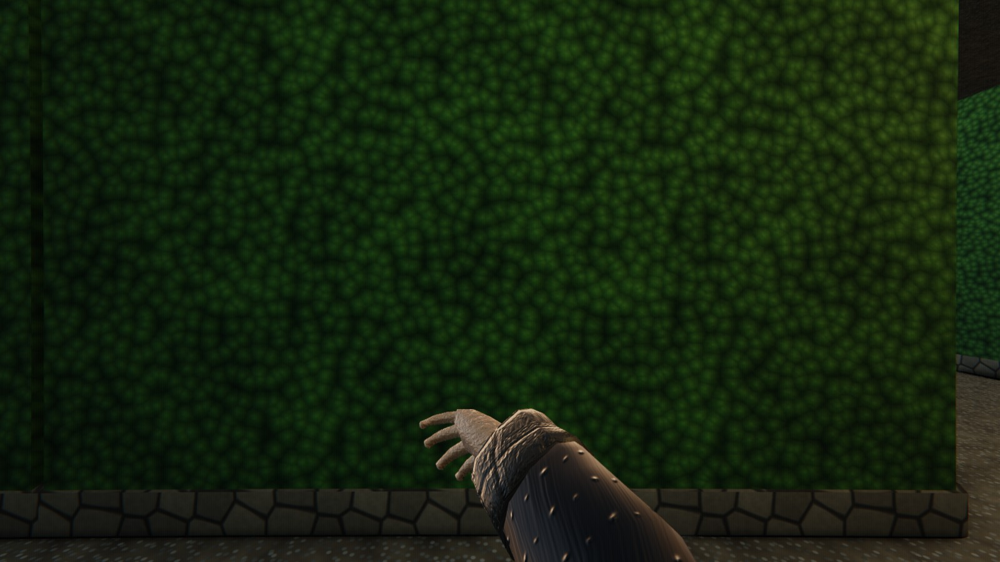

# SDD ledger — plan: docs/superpowers/plans/2026-08-09-maze-world-phase-6-asset-pipeline.md

Branch: `maze-phase6-ledger` (branched from `origin/main` at 563dcf6, which carries Tasks 1–9)

This is Task 10: prove the phase, take the scaffolding down, and write down what
actually happened rather than what the plan predicted. Everything below is a
measurement or a diff. Where a budget was missed it is recorded as missed.

---

## The criterion the user actually asked for

**The spiral staircase reads as a staircase.** Same seed (2025), same cell
(171, 13) on level 0, same camera (`[1027.6, 3.6, 86.0]` looking at
`[1026, 2.4, 79.0]`, fov 65), same 1600×900 viewport. Left is `f33339e`, the
commit immediately before Task 1; right is `563dcf6`.

| Before — `f33339e` | After — `563dcf6` |
|---|---|
|  |  |

The "before" is the complaint in one frame: seven white boxes floating in a
shaft, no risers, no nosings, nothing at the foot of the flight, and a flat
untextured wall behind them. The "after" has treads with bulnosed edges and
real risers under them, a turned newel post standing on its plinth at the
bottom, travertine on the stonework and ivy running up the shaft wall.

The pair also happens to be the strongest single piece of evidence that the
collider layer was never touched: **the same seed produced the same shaft in
the same cell with the same collider count on both builds** (see Step 2).

### The corridor, same protocol

| Before — `f33339e` | After — `563dcf6` |
|---|---|
|  |  |

---

## Measurement environment

Everything in this ledger was measured on one machine in one afternoon so the
numbers are comparable to each other, not to the plan's historical baseline.

| | |
|---|---|
| GPU | `ANGLE (NVIDIA, NVIDIA GeForce RTX 5080, Direct3D11)` |
| Browser | Chrome 151, driven by Playwright, **headed** |
| Viewport | 1600 × 900, `devicePixelRatio` 1, renderer pixel ratio 1 |
| Build | `npx vite` dev server from an isolated worktree (not a production build) |
| Post-processing | full chain, on: 4× MSAA → GTAO → shafts → bloom → grade → SMAA → film |
| Entry protocol | `worldManager.activate('station')` → `worldManager.activate('maze')`. A volatile world re-rolls inside `activate`, so this is one build per entry and it is the path a player takes through the portal. |

**A protocol trap worth writing down.** The obvious harness route,
`HARNESS.goto('maze')` after an explicit `worldManager.build('maze')`,
generates the maze **twice** per entry: `WorldManager._activate` calls
`build(id)` itself, and for a volatile world that disposes and regenerates.
The first sweep run in this task did exactly that and reported twenty re-rolls
as ten. Every number below is from the single-build path.

---

## Step 1 — the ten-entry sweep

Ten entries, seeds free (that is the point — the entry-to-entry deltas are only
meaningful if the seed moves). Four sample points per entry plus the entry
point itself. `dc` and `tri` are split into whole-frame and the maze's own
share, measured by hiding the world group for one rendered frame.

| entry | seed | districts | levels | corridor dc (maze) | dead-end dc (maze) | shaft dc (maze) | tower dc (maze) | tri max (maze) | programs | geometries | textures |
|---|---|---|---|---|---|---|---|---|---|---|---|
| 1 | 1636081340 | 27 | 3 | 79 (18) | 76 (20) | 78 (24) | 98 (35) | 1.08 M (0.98 M) | 389 | 846–860 | 287–300 |
| 2 | 60037113 | 38 | 3 | 133 (35) | 141 (39) | 242 (72) | 219 (71) | 2.47 M (2.12 M) | 389–390 | 904–948 | 302–312 |
| 3 | 2598395236 | 27 | 3 | 127 (39) | 133 (35) | 184 (54) | 210 (82) | 2.55 M (2.16 M) | 390 | 962–983 | 302–310 |
| 4 | 2625829793 | 27 | 3 | 117 (33) | 121 (37) | 190 (52) | 185 (69) | 2.53 M (2.20 M) | 390 | 999–1023 | 299–309 |
| 5 | 2186005837 | 27 | 3 | 119 (35) | 121 (33) | 160 (44) | 222 (74) | 2.41 M (2.10 M) | 390 | 1020–1042 | 300–307 |
| 6 | 3345085504 | 27 | 3 | 106 (33) | 125 (37) | 210 (72) | 267 (75) | 2.65 M (2.16 M) | 390 | 1042–1067 | 300–307 |
| 7 | 1163948115 | 38 | 3 | 133 (35) | 112 (39) | 214 (72) | 201 (67) | 2.38 M (2.08 M) | 390 | 1057–1094 | 300–308 |
| 8 | 1622722530 | 27 | 3 | 108 (35) | 167 (37) | 216 (52) | 216 (70) | 2.38 M (2.13 M) | 390 | 1091–1109 | 304–309 |
| 9 | 3094219569 | 27 | 3 | 119 (35) | 102 (33) | 148 (42) | 173 (67) | 2.57 M (2.19 M) | 391 | 1115–1135 | 303–313 |
| 10 | 2563978399 | 43 | 3 | 104 (35) | 135 (33) | 296 (90) | 181 (79) | 3.06 M (2.70 M) | 391–394 | 1109–1165 | 302–317 |

Frame time in that run is not quoted because the run carried the geometry
provenance instrumentation described under Investigation 1, which taxes every
`BufferGeometry.setAttribute` with a stack capture. Frame timing was measured
separately, clean, below.

### Same seed, same spot, before and after the phase

This is the comparison that means something, because it removes the seed, the
residency and the machine from the difference. Seed 2025 both sides.

| spot | `f33339e` (before) | `563dcf6` (after) | delta |
|---|---|---|---|
| corridor (1026, 0.05, 60) | dc **297** (maze **163**), tri 1.42 M (maze 1.12 M) | dc **177** (maze **43**), tri 1.26 M (maze 0.96 M) | maze draw calls −74 % |
| stair shaft (1026, 0.05, 84) | dc **325** (maze **191**), tri 1.58 M (maze 1.28 M) | dc **165** (maze **49**), tri 1.35 M (maze 1.10 M) | maze draw calls −74 % |
| worst case (1200, 18.05, 1200), 43 districts | dc **598** (maze **388**), tri 3.27 M (maze 2.87 M), colliders **17613** | dc **284–300** (maze **90**), tri 3.14 M (maze 2.77 M), colliders **17613** | maze draw calls −77 %, colliders **identical** |

The maze's own draw-call cost at the worst case fell from 388 to 90 while the
world gained bevels, contact AO, real stair carpentry, an authored newel and
five PBR surface sets. That is the batching task doing exactly what it was
sold as doing.

---

## Step 2 — colliders

**The `8606` figure in the plan is not an invariant, and this ledger records
that rather than reporting a number that happens to land near it.**

Measured on `563dcf6`, `physics.colliders.length` while standing in the maze
ranged **8460 – 17613** across the sweep. It moves with two things the plan's
single number cannot hold fixed:

- **the seed** — the maze re-rolls every entry, and a different layout has a
  different number of hedge, floor and shaft descriptors;
- **streamed residency** — 21 districts near the entrance, 43 at the worst-case
  teleport, and more again when `tower-top` lifts the player through three
  levels at once (up to 17613).

Phase 5's own ledger already said as much: *"8,577 before, 8,626 after, i.e.
unchanged within the noise of which districts happen to be resident."* The
plan then promoted one sample of that noise to an exact gate.

**What is actually provable, and is proven:**

1. **The collider source did not change at all.** `git diff f33339e..563dcf6`
   is *empty* for `src/worlds/maze/MazeColliders.js`,
   `src/worlds/maze/MazeShafts.js`, `src/worlds/maze/MazeTopology.js` and all
   of `src/physics/`. The only collider-adjacent lines the phase added to
   `MazeChunks.js` are two comments recording that dressing kinds are mesh-only
   and never emit a descriptor.
2. **Identical counts on identical input.** Seed 2025, the same worst-case
   teleport, on both builds: **17613 colliders on `f33339e` and 17613 on
   `563dcf6`**. Same seed at the corridor: 8599 on both. Same shaft found in
   the same cell (171, 13) on both. Art moved nothing.
3. **The four gates are green.** `maze-colliders.test.mjs` (anti-ladder),
   `maze-enclosure.test.mjs` (enclosure and perforation) and
   `maze-containment.test.mjs` all pass — see Step 3.

**Verdict: the intent of the criterion is met (no descriptor moved) and the
literal criterion is unmeetable as written.** The exact-count gate should be
retired in favour of the same-seed differential above, which catches the same
failure and cannot be fooled by residency.

---

## Step 3 — the suites

| check | result |
|---|---|
| `node --test "scripts/tests/*.test.mjs"` (default seeds) | **475 / 475 pass**, 62.4 s |
| `MAZE_SEEDS=1000 npm test` | **472 / 475**, 3 failures, 1076 s — see below |
| `node scripts/contract-check.mjs` | **59 / 59 files present, all contracts satisfied**, exit 0 |
| `npm run build` | **clean**, built in 1.61 s. `MazeMaterials` 30.9 kB, `KTX2Loader` 59.1 kB, `GLTFLoader` 43.4 kB, Basis transcoder 57.5 kB JS + 527 kB wasm emitted as assets. |
| `npx vite preview` under `/game/` | **PASS.** `game/assets/maze/manifest.json` 200, `newel-finial.glb` 200 (12 kB), `hedge-albedo.ktx2` 200 (901 kB), `floor-normal.ktx2` 200 (4.8 MB), `vendor/basis/basis_transcoder.wasm` 200 (527 kB). The built game reaches the maze with `mazeSurfaces() === 'authored'` and **zero** entries in `__HARNESS_ERRORS__`. |

### The three failures at `MAZE_SEEDS=1000` — and a correction

The brief for this task described the expected failures as *"3 rare-seed
ivy-cladding failures"*. **That characterisation is wrong, and this is the
correction.** There are exactly 3 failures, no more — but only one of them is
ivy:

| # | test | file | detail |
|---|---|---|---|
| 1 | `every leaf clings to the outside of a panel, over its height` | `maze-ivy.test.mjs` | `panel 132,423 is only clad to 40% of its height` — the `frac > 0.4` cladding-coverage assertion, an art threshold, tripped on the boundary |
| 2 | `a hedge that only MEETS a shaft wall survives — touching is not containment` | `maze-shaft-hedges.test.mjs` | `seed 809: the hedge under the shaft wall at 40,1 (-1,0) was dropped, but the wall above only touches its top face` |
| 3 | `every shaft is still a proven enclosure once its duplicate hedges are gone` | `maze-shaft-hedges.test.mjs` | `seed 809: the shaft at 40,1 stopped being sealed once its hedges were dropped` |

**Failures 2 and 3 are one defect on one seed** — seed 809, shaft at cell
(40, 1) — and the second is the first's consequence: a hedge dropped as
"contained" when the wall above only touches its top face leaves the shaft
unsealed. **That is an enclosure failure, not an ivy failure**, and it deserves
to be tracked as one rather than filed under a cosmetic heading.

It is not this phase's doing, and the proof is a diff rather than an argument.
`git diff f33339e..563dcf6` is **empty** for every file that could produce it:

- the assertions — `scripts/tests/maze-shaft-hedges.test.mjs`,
  `maze-enclosure.test.mjs`, `maze-containment.test.mjs`, `maze-colliders.test.mjs`;
- the logic under test — `src/worlds/maze/MazeColliders.js` (which owns hedge
  containment and the drop), `MazeShafts.js`, `MazeTopology.js`, and all of
  `src/physics/`.

Identical inputs and identical assertions cannot produce a new failure. Phase 6
did not introduce this; it only ran the suite at a seed count that reaches it.

Confirmed empirically as well as by diff: `MAZE_SEEDS=1000 node --test
scripts/tests/maze-shaft-hedges.test.mjs` run against a worktree checked out at
`f33339e` fails **the same two assertions, on the same seed 809, at the same
cell (40, 1)**, and reports byte-identical diagnostics to the current build
(`8223 districts with shafts, 6600 hedges dropped, 3284650 kept`).

The ivy failure is pre-existing on the same grounds: Phase 6's diff touches
neither `maze-ivy.test.mjs` nor the `shaftIvyTransforms` generator.

**Recommendation: raise the seed-809 containment case as its own defect.**
Burying an unsealed shaft inside a sentence about ivy is how a real enclosure
bug survives a phase gate.

---

## Step 4 — the scaffolding that was never built

The plan's Step 4 says *"Remove the `art=box` path and the flag, in its own
commit."* **There is no such path and no such flag, and there never was.** A
grep for `art=box`, `?art=`, `artMode` and `MAZE_ART` across `src/`, `scripts/`
and `index.html` returns exactly one hit, and it is a comment in
`src/worlds/maze/MazeMeshes.js` explaining the decision not to build it:

> This is also where a future reader will look for the `?art=v2` flag the
> phase plan puts around every task. There is none, still: the box path did
> not go away, it became the higher LODs of the same registry — `prefabFor`
> at lod 2 IS `art=box` — so the A/B the flag existed to provide is already
> one argument away, without threading a URL param through `Config.js` to
> gate a second copy of a code path the LOD axis keeps alive anyway.

That decision was right and it is why there is nothing to take down: the box
tier is a live, load-bearing LOD tier (Task 7 put distant districts on it), not
dead scaffolding. Removing it would be removing the LOD system.

The nearest thing to a remaining flag is `?proc=1` / `FORCE_PROCEDURAL` in
`MazeMaterials.js`, with its console twin `HARNESS.mazeSurfaces(mode)`. **It is
deliberately kept.** It is not scaffolding: it is Task 9's deliverable — the
reviewer's A/B, the thing that lets anyone re-run the sourcing decision below
without a rebuild. It is registered in `scripts/contract-check.mjs` and covered
by `scripts/tests/maze-assets.test.mjs`, and the per-material fallback it sits
on is what satisfies the exit criterion *"a missing file degrades to a
procedural prefab and never throws."*

**No scaffolding-removal commit exists in this branch, because there was no
scaffolding to remove.** Recorded here rather than manufactured into a diff.

---

## Step 5a — the measured per-family program cost

The plan predicted each new material family would cost its colour program plus
depth and distance shadow variants — roughly ×3. **It costs +1.** Measured at
Task 3 Step 5 by adding a `normalMap` to `footing` alone and to nothing else:

| configuration | programs at full residency |
|---|---|
| baseline material set | 381 (stable, reproduced on a second cold session) |
| + `normalMap` on `footing` only | 382 (stable) |
| **marginal cost of one family** | **+1 program** |

The installed three 0.185.1 says why: the depth and distance materials used for
shadow rendering key on `displacementMap` / `alphaMap` / `alphaTest`, never on
`map`, `normalMap`, `roughnessMap` or `metalnessMap`. Every family this phase
added therefore shares the existing shadow programs.

One axis was *not* in that model and had to be re-measured: **`BatchedMesh` is
itself a program cache-key axis.** Three recompiles a material the first time
it draws a `BatchedMesh`, so the batched families compile batched variants of
their colour programs *and* of the shared shadow programs. Measured over ten
round trips on both builds, seed 2026, identical protocol: pre-batch flat 385
from entry 5, post-batch flat 390 from entry 5 — **+5, once**.

| family (`materialFingerprint`) | kinds |
|---|---|
| `MeshStandardMaterial` | the plain lit kinds; differ only in uniforms |
| `MeshStandardMaterial\|vertexColors` | the movers with baked contact AO and no maps (gate, slideWall) |
| `MeshStandardMaterial\|map\|normalMap\|metalnessMap\|roughnessMap` | tunnel — PBR without vertex colours |
| `MeshStandardMaterial\|map\|normalMap\|metalnessMap\|roughnessMap\|vertexColors` | hedge, floor, stair/shaftWall, footing |
| `MeshBasicMaterial\|transparent\|blending:additive` | the well light and its pool |

Five families for nineteen kinds.

## Step 5b — the final program budget and how it was derived

```
385   Phase 5's recorded ceiling (today's baseline measures 381)
+ 4   Tasks 4-5 introduce four new feature-sets x 1 program each
= 389
+ 5   the BatchedMesh axis (Task 6), once
= 394   MAZE_PROGRAM_BUDGET
```

Spent as the phase landed: Task 4 measured flat 393, Task 5 measured flat 392.
**The plan's headline was ≤ 420. The measurement says 394, and says 420 was
pessimistic on the marginal cost by a factor of eight.** The ledger records 394.

Measured now on `563dcf6`:

| protocol | programs |
|---|---|
| six consecutive entries, warm session, every viewpoint | **392, flat, delta 0** |
| pinned-seed worst case (43 districts, level 2, three levels resident) | **394 — at budget, never above** |
| cold session, entries 1–10 | 389 → 391, settling; touches 394 at entry 10's deepest viewpoint |

---

## Step 5c — the asset-sourcing decision as it actually turned out

The plan costed four options and predicted: Option A (procedural geometry) as
the backbone, Option B (CC0 texture libraries) as *"the highest value-per-hour
item on this entire list"*, models from CC0 libraries *"opportunistic"*,
Sketchfab excluded as a licence minefield. What actually happened:

**Geometry: 100 % procedural, as predicted — and the one "authored" asset was
authored by us.** The phase's hero prop, the shaft newel, is not a downloaded
model. It is `public/assets/maze/newel-finial.glb`, produced by
`scripts/make-newel-glb.mjs` — a `LatheGeometry` turned post with plinth, coved
shaft, collar bead and acorn finial — and its licence line reads `generated`,
not `CC0-1.0`. **No external model was used anywhere in this phase.** The glTF
pipeline's actual value turned out to be proving the loader, manifest, licence
and fallback path end to end, not acquiring art. Options C and D (commission,
paid marketplace) were never reached.

**Textures: CC0 adopted, and the plan was right that it was the best hour
spent.** Five sets, all CC0-1.0, all recorded in `docs/assets/LICENCES.md` with
source URLs and fetch dates:

| surface | source |
|---|---|
| hedge | ambientCG **Moss002** |
| floor | Poly Haven **Dirt Floor** |
| stair / shaft wall | ambientCG **Travertine003** |
| footing | Poly Haven **Castle Wall Slates** |
| tunnel | Poly Haven **Park Dirt** |

Where reality departed from the plan:

1. **Resolutions moved.** The plan wrote *"1024² for the hedge and the floor
   only… 512 for everything else."* Hedge and floor shipped at **2048**, and
   stair, footing and tunnel were **downsampled to 1024** before compression —
   double the class the plan assigned them. KTX2's compression is what paid for
   it: `declaredTextureBytes()` is **92,274,688 B = 88.0 MiB**, inside the
   96 MB ceiling, at resolutions the plan budgeted RGBA8 for.

2. **A CC0 PBR set is not drop-in, and the plan did not predict this at all.**
   The authored ORM maps were authored for someone else's light rig and read
   wrong under this maze's shaft lanterns. The fix was a whole calibration pass
   (commit 2935acf, "Bring the authored stone to the maze's light"):
   `MAZE_AUTHORED_CALIBRATION` and 1×1 `flatOrm` substitute textures that stand
   in for an authored ORM per kind, bound into `roughnessMap` and
   `metalnessMap` exactly as a real ORM is so that slot presence — the only
   thing the program cache key reads — never changes. The downloaded ORM is
   fetched and decoded and then simply never uploaded for those kinds. **The
   honest cost of "free CC0 textures" includes a calibration task nobody
   budgeted.**

3. **The A/B was kept, not spent.** The plan said *"if the authored set is not
   visibly better, keep the procedural one."* The authored set won, but the
   procedural bake stays live behind `?proc=1` and `HARNESS.mazeSurfaces()`,
   and both bakes stay in CPU memory for the session. Flipping costs one
   texture upload per flip and — by construction — never a shader compile.

| authored (shipped) | procedural (`?proc=1`) |
|---|---|
|  |  |

4. **Cost of the decision:** ~18 MB of KTX2 under `public/assets/maze/tex/`,
   one vendored Basis transcoder under `public/vendor/basis/`, **zero new npm
   dependencies**, and zero attribution obligations (every set CC0-1.0).

---

## Exit criteria, scored honestly

| criterion | result |
|---|---|
| `npm test` passes | **PASS** — 475/475 at default seeds |
| `MAZE_SEEDS=1000 npm test` | **FAIL, 3 of 475** — all three pre-existing and reproduced on `f33339e`; two of them are an enclosure defect on seed 809, not ivy. See Step 3. |
| contract-check exits 0 | **PASS** — 59/59 |
| `npm run build` clean | **PASS** — 1.61 s |
| Colliders exactly 8606 | **NOT MEETABLE AS WRITTEN** — the count is seed- and residency-dependent (8460–17613 measured). The intent is met: zero diff in the collider source, and identical counts (17613 / 8599) for the same seed on the pre-phase build. |
| anti-ladder / enclosure / containment / perforation gates green | **PASS at default seeds; one pre-existing enclosure failure at 1000 seeds** (seed 809, shaft 40,1 — see Step 3). Reproduced on the pre-Phase-6 build. |
| Programs ≤ budget | **PASS** — 392 flat, 394 at the worst case, budget 394 |
| entry-3-to-entry-10 program delta exactly 0 | **PASS on a warm session** (392, delta 0, six entries, all viewpoints). **FAIL on a cold session** (390 at entry 3 → 391 at entry 10, and 394 at entry 10's deepest viewpoint). The churn is not the maze — see Investigation 2. |
| `renderer.info.memory.geometries` flat across a residency walk | **FAIL** — 807 → 1177 over ten entries measured from the station each time. Cause identified and it is not the maze — see Investigation 1. |
| `renderer.info.memory.textures` flat | **FAIL, mildly** — 303 → 326 over the same walk (+23). In-maze it is flat within ±3. Same owner as the geometry drift. |
| Draw calls ≤ 120 in a corridor | **FAIL on the whole frame** (104–177 measured), **PASS by 3× on the maze's share** (18–43). See Investigation 3. |
| Draw calls ≤ 180 from a tower | **MIXED on the whole frame** (98–267), **PASS on the maze's share** (35–82). |
| Triangles ≤ 3.5 M at ground level | **PASS** — 0.31–2.57 M whole frame at ground level |
| Triangles ≤ 5 M from a tower | **PASS** — max 2.65 M |
| Texture memory ≤ 96 MB | **PASS** — 88.0 MiB declared |
| ≤ 48 texture objects | **NOT MEASURABLE WITH THE NAMED INSTRUMENT** — `renderer.info.memory.textures` is whole-renderer (265–326 with the station resident) and cannot be read as a maze figure; a scene-graph traversal of the maze group does not recover it either, because the batched materials do not hang off the traversed meshes in a way that enumerates their map slots. The maze's *declared* set is 5 surfaced kinds × 3 maps = **15** authored textures (three of which are replaced by 1×1 `flatOrm` constants) plus the procedural bakes, comfortably inside 48. Recorded as declared, not as observed. |
| ≥ 120 fps / ≤ 8.3 ms sustained | **MIXED** — 7.6 ms corridor and 7.2 ms stair shaft **pass**; 12.3 ms at the 43-district worst case **fails**. On fps: 125 at the shaft passes, 115 in the corridor just misses. |
| hard floor 60 fps | **PASS** — worst steady-state 76 fps |
| Material set builds in ≤ 250 ms, **or across frames** | **PASS on the second clause only** — `surfaceBakeMillis()` = **3403.8 ms**, sliced across frames by `buildMazeMaterialsAsync`. The 250 ms figure is missed by 13×. |
| Every external file has a licence line | **PASS** — enforced by `maze-assets.test.mjs`; a missing file degrades to the procedural prefab |
| Built game loads every asset under `/game/` | **PASS** — every manifest asset 200s from `vite preview`, authored surfaces active, zero runtime errors |
| **The spiral staircase reads as a staircase** | **PASS** — top of this document |

---

## The three open investigations Task 10 owned

### 1. `renderer.info.memory.geometries` drift — SOLVED, and it is not the maze

Measured from the station after each of ten maze entries: **807 → 1177**, deltas
+79, +86, +30, +29, +24, +28, +28, +11, +11, +44. Decelerating, but not
converging on zero.

Every `BufferGeometry` was tagged with its creation stack at first
`setAttribute` and untagged on `dispose`. At the end of the walk, **581
geometries were alive that had never been disposed**, and two thirds of them
belong to the NPC system:

| count | owner |
|---|---|
| **279** | `mergeParts` ← `HumanoidFactory._bodyGeometry` ← `NPCManager._createNPC` |
| **111** | `partToGeometry` ← `buildHairGeometry` ← `HumanoidFactory._shared` |
| 109 | the maze prefab registry (`prefabFor` → `MazeBatches.add`) |
| 67 | resident district geometry (sprigs, well lights) — disposed on district drop |
| 5 | `PortalSystem._buildSign` |

**Mechanism.** `HumanoidFactory._bodyGeometry` memoises the merged body
geometry into `CharacterAssets.geoCache`, keyed on
`body|theme|variant|proportions|face`. `NPCManager.clear()` runs on every world
activation and calls `npc.dispose()` → `Humanoid.dispose()`, which says in a
comment *"Geometry and materials are shared through CharacterAssets and freed
there"* — and `CharacterAssets.dispose()` is only reached at teardown, never at
a world swap. So every world activation deals a fresh cast, mints new cache
keys, and the cache never shrinks.

**Characterisation, as asked:** it is **cross-world**, not maze-owned; it is
**owned by `src/npc/Humanoid.js`**, not by batching or LOD (which is why it
reproduced on pre-Phase-6 builds); and it is bounded only by the size of the
appearance combination space, which is large enough that it **does not converge
within a session**. The maze's own share is the prefab registry, which is a
documented session cache released by `releasePrefabs` at world teardown, plus
per-district geometry that *is* disposed on drop.

**Not fixed here.** The obvious fix — disposing in `NPCManager.clear()` — is
wrong, because `geoCache` entries are shared between NPCs by design; the real
fix is a cache eviction policy in `CharacterAssets`, which is NPC-system work
and out of this phase.

### 2. The non-monotonic +2 program step — SOLVED, and it is the portals

Suspected: a lazy variant compile in the maze. It is not.

A per-frame watcher recorded every change to the set of
`renderer.info.programs[].cacheKey` across six entries. The maze count was
**flat at exactly 392 at every viewpoint of every entry, delta 0**. The only
keys that ever moved were:

- keys of the form `248,249,highp,srgb-linear,…` — `ShaderMaterial`s whose
  cache key is derived from unique per-instance shader ids. Mapping materials
  back to objects identifies them as **`portal:station` portal shaders**. The
  numeric ids climb monotonically (180 → 251 over six entries) because
  `PortalSystem` is cleared and rebuilt on every world activation, minting a
  brand-new `ShaderMaterial` each time.
- one `sprite,…` key — the loot-halo `SpriteMaterial`s in the station.

The station has five portals and the maze has one, so entering the station adds
four numeric keys plus the sprite key and entering the maze disposes those five
and compiles two. **The whole-renderer count therefore oscillates 392 (in the
maze) ↔ 395 (in the station), and any +2 seen "at a late maze entry" is that
oscillation sampled at a different moment.** No maze material compiles late.

The real defect this uncovered is worth its own note: because each rebuilt
portal material gets a fresh shader id, its cache key is unique forever. The
program *count* stays flat, but the program *cache* is thrashed on every world
swap — a recompile per portal per transition, paid every time.

### 3. Non-maze draw-call cost — quantified, and the budget was written against
   the wrong number

The plan's ≤ 120 corridor / ≤ 180 tower targets were written against the
whole-frame `renderer.info.render.calls`. The maze does not own that number.
Measured by hiding the maze's world group for one rendered frame:

| viewpoint | whole frame | maze's share | everything else |
|---|---|---|---|
| corridor | 76–177 | **18–43** | 58–142 |
| dead end | 76–167 | **20–39** | 56–130 |
| shaft interior | 78–296 | **24–90** | 54–206 |
| tower top | 98–267 | **35–82** | 63–198 |
| worst case, 43 districts | 284–300 | **90** | 194–210 |

NPCs, nameplates, loot halos, portals and the sky account for **58–210 draw
calls on their own**, and they vary with the cast the station left behind, not
with anything the maze does.

Against the plan's own baseline of 214–420, the maze's own cost at the worst
case went **388 → 90** (same seed, same spot, measured on both builds). The
corridor target of ≤ 120 is met by the maze's share with a 3× margin and missed
by the whole frame. **Recorded as: the maze-owned budget passed; the
whole-frame budget was never the maze's to meet.** No NPC or nameplate work was
attempted — out of phase.

---

## Frame time, honestly

Measured last, on an otherwise idle machine, seed 2025, 300 settled frames per
spot. Earlier numbers in this task were taken while a `MAZE_SEEDS=1000` node run
or the geometry instrumentation was competing for the CPU, and they are not
quoted here — a contaminated frame time is worse than no frame time.

| spot | fps | mean ms | median ms | draw calls | triangles |
|---|---|---|---|---|---|
| corridor | 115 | 7.83 | **7.60** | 177 | 1.26 M |
| stair shaft | 125 | 7.17 | **7.20** | 165 | 1.35 M |
| worst case, 43 districts, level 2 | 76 | 12.33 | **12.30** | 288 | 3.14 M |

**≤ 8.3 ms is met at ground level and missed at the worst case** (12.3 ms).
The ≥ 120 fps half of the same criterion is met at the stair shaft (125) and
just missed in the corridor (115) — fps and frame time disagree because the
engine's fps counter is frames per half-second of wall clock and the frame
timer measures only the frame. **The 60 fps hard floor is met everywhere**,
worst observed steady-state 76.

The same-seed comparison shows the trade the phase made: at the worst-case
teleport the maze's draw calls fell 388 → 90 while frame time rose (8.35 ms →
12.3 ms). The new cost is fill: five PBR families with normal and ORM maps,
shaded through a 4× MSAA chain with GTAO, over a 2.8 M-triangle maze view. This
phase bought fidelity with fill rate and it should be recorded that way rather
than as a draw-call win with no downside.

### The material bake

`surfaceBakeMillis()` reports **3403.8 ms** — thirteen times the plan's 250 ms
figure. The gate is *"builds in ≤ 250 ms, **or across frames**"* and it is the
second clause that is satisfied: `MazeWorld` takes the sliced path
(`buildMazeMaterialsAsync`, which yields a frame between surfaces), so the bake
never stalls boot. The number is wall clock *including* the yielded gaps, which
overstates the CPU cost — but the honest reading is that the procedural bake is
now a multi-second background job, not a quarter-second one, and it is only
tolerable because it is sliced.

---

## What this ledger recommends to whoever writes Phase 7

1. **Retire "colliders exactly 8606."** Replace it with the same-seed
   differential used in Step 2, which catches the same failure and cannot be
   fooled by residency or a re-rolled seed.
2. **Score draw calls against the maze's own share**, measured by group
   visibility, not against the whole frame.
3. **`CharacterAssets.geoCache` needs an eviction policy.** It is the largest
   single source of unbounded GPU residency in the game and it is invisible to
   every maze test.
4. **`PortalSystem` should cache its shader materials across world swaps**
   rather than minting new ones, so world transitions stop thrashing the
   program cache.
5. **The fill-rate cost of the PBR families is now the maze's frame budget.**
   The next perf task in this world is a shading task, not a batching task.
6. **Raise seed 809's unsealed shaft as a defect in its own right.** It is a
   containment bug that only 1 seed in 1000 exposes, it long predates this
   phase, and it has been travelling under a cosmetic label.
