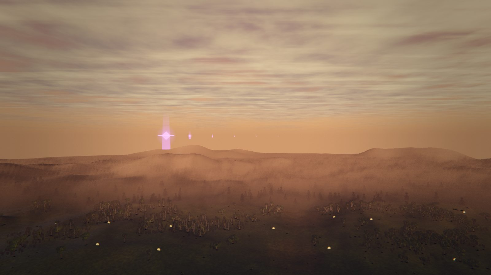
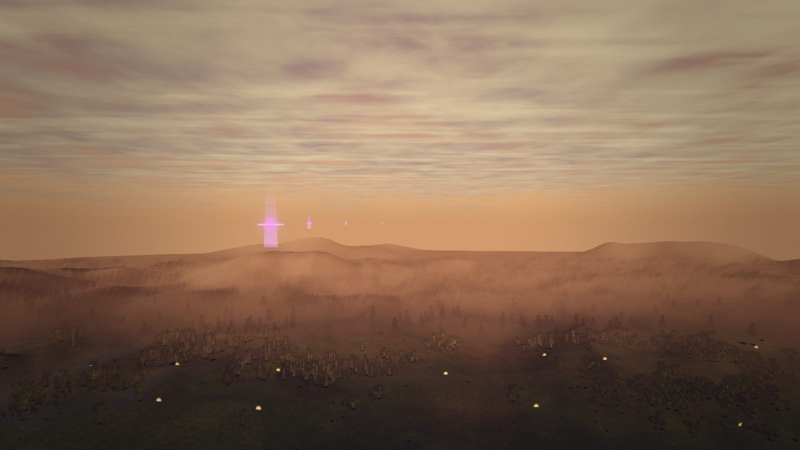
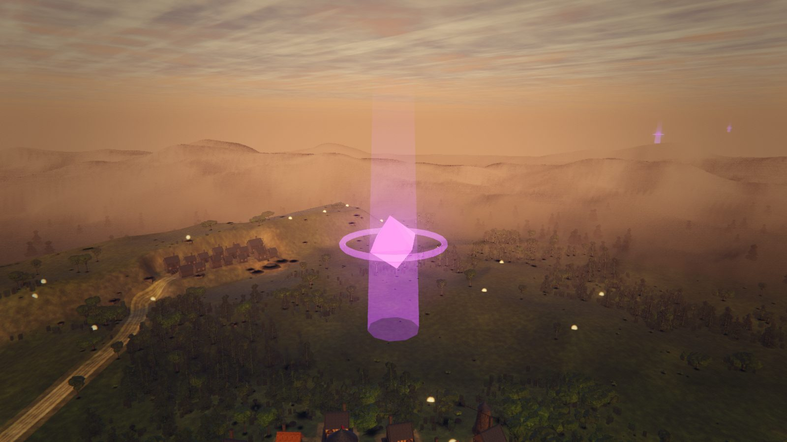
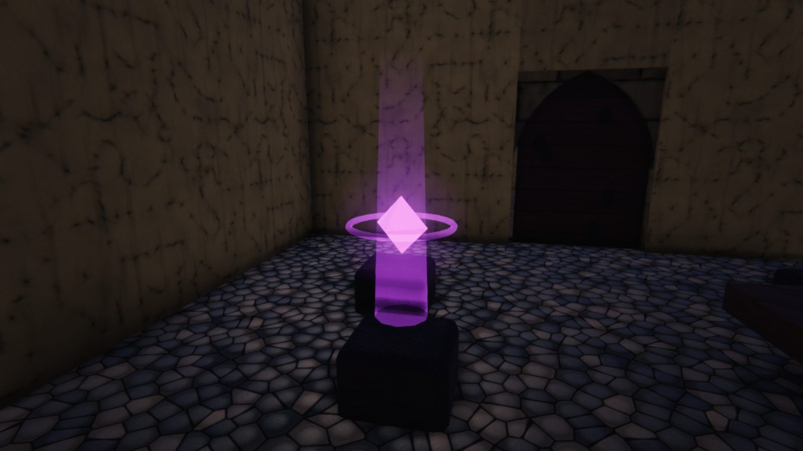
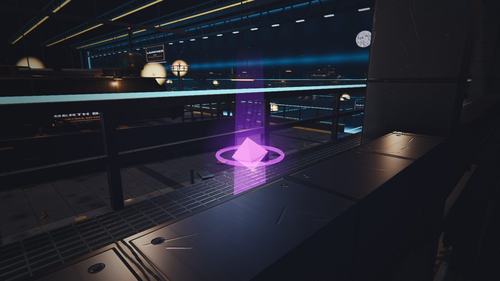
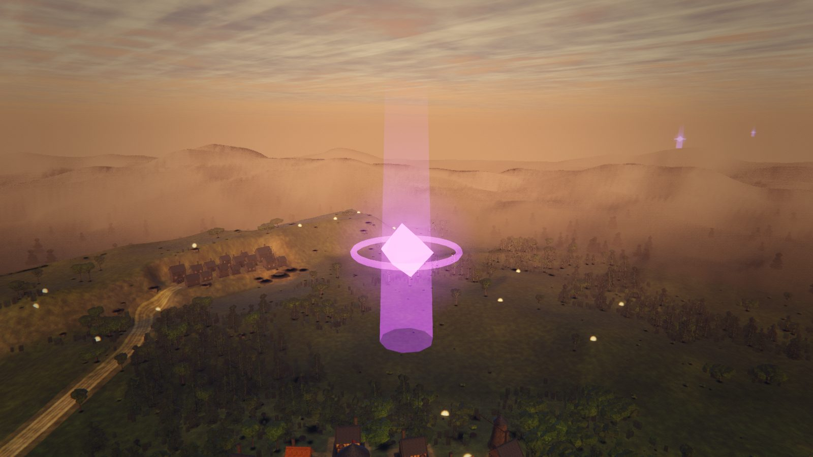
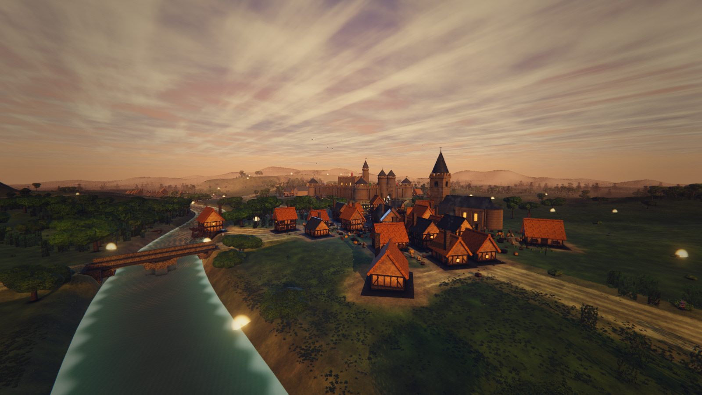
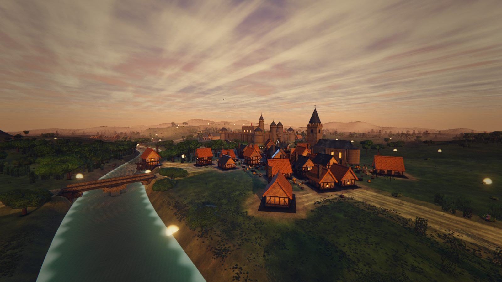

# Phase 9 — `art-loot`: the pickup that four branches diagnosed and none could fix

**Branch:** `art-loot` · **Scope:** `src/systems/Loot.js` only, plus one new test
**Worlds measured:** `medieval`, `citadel`, `dock` · **Not pushed, not merged.**

`src/systems/Loot.js` is shared by nine worlds. `art-medieval`, `art-station`,
`art-dock` and `art-citadel` each independently photographed the same defect in
it, each diagnosed it, and each deliberately declined to fix it — correctly,
because Phase 9 is staged one world at a time precisely so that a cross-world
change is never made from a single world's branch. The consequence was that no
world branch would ever fix it. This branch is the cross-world change, with the
diagnosis already done.

---

## 1. What was wrong, restated as numbers

`Loot.js` stacks four layers per pickup, and until this branch three of them
carried `fog: false`:

```
loot.core.<kind>   MeshStandardMaterial   emissive <accent>  emissiveIntensity 2.6
loot.ring.<kind>   MeshBasicMaterial      AdditiveBlending   opacity 0.75  fog: false
loot.halo.<kind>   SpriteMaterial         AdditiveBlending   opacity 0.85  fog: false
loot.beam.<kind>   MeshBasicMaterial      AdditiveBlending   opacity 0.35  fog: false
```

### 1.1 A violet pickup rendered white

Measured on the controlled ladder of §2.2, at 10 m, in Aldermoor Vale: a
`trinket` — accent `#d46bff`, a strong violet — put **`rgb(252,211,249)`** on
the film, saturation **0.163**. At 40 m, 86 m and 150 m the red channel was
**hard against 255**. The close framing read **`rgb(255,208,251)`**, saturation
**0.184**: red and blue both clipped.

The mechanism is stacking, not any one layer. The renderer is
`ACESFilmicToneMapping` (`src/core/Engine.js`), and ACES desaturates as it
compresses. The core and the halo are coincident — the sprite is centred on the
octahedron — so the tone mapper saw `2.6 + 0.85 ≈ 3.45` times the accent's
linear radiance and answered with white. Bloom then spread that white onto the
ground: every world's threshold is scene-referred (`medieval` 1.30, `dock` 2.40,
`src/gfx/PostFX.js`) and 3.45 clears all of them.

The kind colour is a gameplay signal — cyan is ammunition, violet is a trinket,
amber is money — so this was not only a look.

### 1.2 Three of the four layers ignored the haze entirely

One picture settles this. Both frames below are the same pickup at 2.44 m in
Aldermoor Vale, with the scene's own fog wound in to `near 0.1 / far 0.2` and
its colour set to black, so **every fogged fragment in the frame is fully
fogged**. Nothing else was touched between them.

| before | after |
| --- | --- |
|  |  |

In the before frame the octahedron is **black** — the core is a
`MeshStandardMaterial`, its `fog` defaulted to `true` and it always obeyed —
while the ring, the halo and the beam blaze away at full strength through total
haze. That is the fault, isolated, with no distance, no rasteriser and no
cross-run comparison in it:

| | contribution under the world's real haze | under **total** haze | surviving |
| --- | --- | --- | --- |
| before | `d(223,196,229)` dLum 204.1 | `d(214,92,206)` dLum 126.2 | **0.618** |
| after | `d(216,159,225)` dLum 175.9 | `d(-2,-2,-2)` dLum −2.0 | **−0.011** |

---

## 2. The instrument

`.probe/art-loot/loot-probe.mjs` (gitignored; the tree is `.probe/`-clean by
policy). It boots a world exactly the way `scripts/world-shot.mjs` does — same
CDP flow, same `gameplayDriven: true` guarantee, same real-GPU ANGLE path
(`NVIDIA GeForce RTX 5080, D3D11` on every run below) — and then does four
things world-shot does not.

### 2.1 Pixel measurement, with an ablation verified against the pixels

Every framing is shot **twice**: once normally, once with
`GAME.loot.group.visible = false`. Differencing the pair isolates the pickup's
own contribution from whatever it was drawn over.

`art-sports` reported that an ablation can announce meshes hidden and hide
nothing. Nothing here rests on a hit count. The loot ablation is checked
against the film every time (`.probe/art-loot/ablation-check.mjs`), and the
check is what produced §5.1. Two further guards:

- **A null pair.** Two frames with *nothing* changed between them, at the same
  vantage. On the ladder framings the null floor is **dLum 0.0–0.8**; on the
  world framings it ranges from **0.0 to 70.4** depending on what is animating.
  Every figure below is reported with the local null value beside it, and
  nothing within its own noise floor is claimed.
- **A freeze.** `HARNESS.freezeAll(true)` before the pair. This is
  load-bearing: a pickup bobs ±0.075 m, which at 16 m is ten screen pixels
  between the projection and the shutter. The first run without it read empty
  ground next to every blob and reported a delta of 3 — a whole set of
  confident null results.

### 2.2 A controlled distance ladder

`GAME.loot.clear()`, then one accent (`nexus_shard`, kind `trinket`) planted at
eight metre marks on eight bearings from one vantage 140 m over the vale,
looking level at the haze. One accent, one backdrop, eight distances, and the
marks are **fanned** rather than stacked: the first version put all of them
straight down the camera axis, where all eight projected to the same pixel and
the sampler read the nearest one eight times — which is exactly how you get a
perfect 1.000 ratio for entirely the wrong reason.

The marks are chosen against the world's own fog ramp, not for roundness.
Aldermoor Vale is `THREE.Fog(near 86, far 880)` (`MedievalWorld.FOG_NEAR/FAR`)
and Three's linear fog is a **smoothstep** over that span, so 10 m and 40 m sit
in the band where *no attenuation is the correct answer*.

### 2.3 The fog crush

§1.2. Distance-free, coverage-free, single-session.

### 2.4 An exact program count

`renderer.info.programs.length` is a cumulative, view-order-dependent,
streaming-dependent figure (§4.2 shows it swinging 74 wide on unchanged code).
So the probe also reads `renderer.properties.get(m).currentProgram` for each of
the twenty loot materials and counts the **distinct programs the loot materials
are actually bound to** — one session, no cross-run comparison.

---

## 3. What changed, and why each number

All of it is `src/systems/Loot.js`. No world file, no `Harness.js`, no
`main.js`, no placement, no collection radius, no hitbox.

### 3.1 The intensity budget

```
core  emissiveIntensity  2.6  -> 1.1     albedo  x0.35 -> x0.5
ring  opacity            0.75 -> 0.5
halo  opacity            0.85 -> 0.4
beam  opacity            0.35 -> 0.25
```

The core keeps the largest share because it is the layer with a silhouette;
the halo gives up the most because it is the layer that sat exactly on top of
the core and did the clipping. The albedo goes **up** to compensate: with less
emissive, more of the octahedron's read has to come from its lit facets, which
is the half that carries a highlight and a shape. It shows — in the close
framings below the octahedron has visible faces after the change and is a flat
white lozenge before it.

The invariant, pinned in the test, is the **coincident sum**
`core.emissiveIntensity + halo.opacity ≤ 1.6`. That is the only number the tone
mapper sees at the centre of a pickup. A later pass may split the budget
differently; a sum past 1.6 is the blow-out coming back.

### 3.2 Aerial perspective for the additive layers

`fog: true` on its own **makes this worse**, and that is the trap this branch
had to route around. Three's stock `<fog_fragment>` is
`mix( colour, fogColor, fogFactor )`, which is right for a surface being
*veiled* by haze and wrong for an additive layer being *added* to what is
behind it: a fully fogged additive card would add `fogColor` at full strength
and paint a hard dot of pure haze colour over the sky — brighter at 800 m than
at 8 m.

Emitted light is swallowed by haze, not tinted by it. So the three additive
layers take `fog: true` **and** a chunk replacement:

```glsl
gl_FragColor.rgb *= 1.0 - fogFactor;      // instead of mix( …, fogColor, … )
```

This is not a new idea here. `src/systems/Projectiles.js` and
`src/systems/VFX.js` already carry `#ifdef ADDITIVE_BLEND col *= 1.0 - fogFactor;`
in their own particle shaders, with the same one-line reason. Those two own
their shaders outright; these three are stock Three materials, so the same rule
arrives as a `<fog_fragment>` replacement through `onBeforeCompile`.

Three details that are deliberate:

- **One shared patch function and one constant `customProgramCacheKey`.**
  `Material.customProgramCacheKey()` returns `onBeforeCompile.toString()` by
  default, so a closure declared inside the per-kind loop would hand fifteen
  distinct functions to the program cache. Three hashes the *text*, so they
  would in fact still collide — but this project has a documented history of
  1.65 s and 63 s freezes from program-cache misses, and relying on a
  coincidence there is not good enough. Asserted in the test.
- **The chunk sits after `<tonemapping_fragment>` and `<colorspace_fragment>`**
  in both `meshbasic` and `sprite`, so the multiply lands on the encoded value.
  Left alone on purpose: it attenuates emitted light by `(1 - fogFactor)^2.4`
  in linear terms — slightly faster than haze veils a surface, which is the
  right side to err on for the things that were punching through it.
- **Worlds with no fog are untouched.** `USE_FOG` needs `scene.fog` as well as
  `material.fog`, and `main.js applyEnvironment` leaves `scene.fog = null`
  wherever `environment.fogFar` is 0 — the station interior, the maze. A world
  with no aerial perspective has none for a pickup to match, and this compiles
  out to nothing there. `SportsWorld`'s `FogExp2` is handled: the replacement
  carries both the `FOG_EXP2` and the linear branch.

The core needed nothing: `MeshStandardMaterial` defaults `fog` to `true` and
this file never turned it off, so it was already receding with the scene. Only
the additive three had opted out.

### 3.3 The material names are kept

`--ablate` matches **by material name** and it is the only tool in the
repository that can answer "which system drew this pixel". Two of five art
branches found their world's materials entirely anonymous, which makes the
whole A/B silently useless. `Loot` is diagnosable only because it names all
twenty, and the test now asserts it does.

---

## 4. The measurements

### 4.1 Pixels

**The ladder, Aldermoor Vale, one `trinket` accent, null floor dLum 0.0–0.8.**
`clip` marks a channel at 255.

| dist | before rgb | clip | sat | after rgb | clip | sat |
| ---: | --- | :-: | ---: | --- | :-: | ---: |
| 10 m | `252,211,249` | — | 0.163 | `250,196,240` | — | 0.216 |
| 40 m | `255,207,251` | **R** | 0.188 | `243,184,226` | — | 0.243 |
| 86 m | `255,205,251` | **R** | 0.196 | `251,175,242` | — | 0.303 |
| 150 m | `254,198,245` | **R** | 0.220 | `232,173,199` | — | 0.254 |
| 250 m | `240,174,222` | — | 0.275 | `222,163,166` | — | 0.266 |
| 350 m | `232,165,199` | — | 0.289 | `225,158,179` | — | 0.298 |
| 500 m | `220,161,159` | — | 0.277 | `221,160,166` | — | 0.276 |
| 700 m | `214,156,143` | — | 0.332 | `211,154,128` | — | 0.393 |

**No channel clips anywhere after the change.** Three marks clipped before it.

| before | after |
| --- | --- |
|  |  |

**Close framings — the pickup's own pixel, three worlds.**

| world | before | after |
| --- | --- | --- |
| medieval, `trinket` @2.5 m | `rgb(255,208,251)` sat **0.184** | `rgb(255,161,242)` sat **0.369** |
| citadel, `trinket` @2.45 m | `rgb(255,212,251)` sat **0.169** | `rgb(247,169,243)` sat **0.316** |
| dock @2.5 m | `rgb(241,248,199)` sat 0.198 (`consumable`) | `rgb(248,167,244)` sat 0.327 (`trinket`) |

The dock pair is the weakest of the three and is labelled as such: cache
streaming put a different accent nearest the camera in the two runs, so it is a
before/after of the *system*, not of one pickup. The medieval and citadel pairs
are the same accent at the same range.

**`citadel/tower-top` — the same three pickups at the same distances in both
runs, which makes it the cleanest world-framing comparison here.**

| dist | before | after |
| ---: | --- | --- |
| 103.9 m | `rgb(170,120,168)` sat 0.294, d(107,73,138) dLum 84.9 [null 0.2] | `rgb(150,92,150)` sat **0.387**, d(84,43,118) dLum 57.1 [null 0.3] |
| 152.6 m | `rgb(229,189,215)` sat 0.175, dLum 24.8 [null 1.2] | `rgb(221,177,202)` sat 0.199, dLum 15.4 [null 0.0] |
| 359.9 m | `rgb(178,177,176)` sat 0.011, dLum 14.2 [null 1.0] | `rgb(177,178,175)` sat 0.017, dLum 12.6 [null 0.0] |

**`dock/trench` — four pickups, identical positions in both runs.**

| dist | before | after |
| ---: | --- | --- |
| 6.1 m | `rgb(253,221,250)` sat 0.126 | `rgb(252,236,240)` sat 0.063 |
| 28 / 42 / 44 m | `rgb(255,229,252)` **R,B clipped** sat 0.102 | `rgb(250,212,243)` — sat 0.152 |

The 6.1 m row moved the wrong way and is reported rather than dropped: that
pickup sits directly in front of a bright warm corridor luminaire, and additive
light over an already-bright backdrop washes whatever its own hue. The
clipping at 28–44 m is gone, which is the row that mattered.

**Integrated contribution on the ladder** (sum of per-pixel delta luminance
over a 53×53 box, thresholded at 4 lum/px to clear the null floor). Reported
because the peak-pixel figure is honest but jittery past 250 m, where the halo
sprite is under a pixel wide and which sub-pixel it lands on decides the
answer:

| dist | 10 | 40 | 86 | 150 | 250 | 350 | 500 | 700 |
| --- | ---: | ---: | ---: | ---: | ---: | ---: | ---: | ---: |
| before | 53064 | 4583 | 995 | 280 | 78 | 40 | 12 | 13 |
| after | 30021 | 2823 | 631 | 227 | 40 | 23 | 11 | 5 |

Past 250 m both columns are a handful of pixels above the floor and the
after/before ratio there is quantisation, not signal. **The distance claim in
this report rests on the fog crush of §1.2, not on this table** — that test is
the one with no coverage term in it.

### 4.2 Budget, and the noise floor first

`art-citadel` established the rule: a number without a noise floor is not a
measurement. Here is this branch's, taken by running the **same tree twice**
over the same views in the same order:

| view (dock) | before run 1 | before run 2 | after run 1 | after run 2 |
| --- | ---: | ---: | ---: | ---: |
| `apron-arrival` | 275 | 275 | 275 | 275 |
| `keel-line` | 275 | 275 | 275 | 275 |
| `trench` | 311 | **275** | 326 | **349** |
| `yard-wide` | 362 | 362 | 364 | 364 |

`renderer.info.programs.length` at `trench` spans **275 → 349 on unchanged
code**. It is cumulative and moves with streaming and view order. It cannot
answer the question, so it is reported and then set aside.

**The question it cannot answer, answered exactly.** Distinct shader programs
the twenty loot materials are bound to, read out of the renderer's own
per-material properties in a single session:

| | before | after |
| --- | ---: | ---: |
| loot materials compiled | 12 of 20 (8 cold) | 12 of 20 (8 cold) |
| **distinct programs they consume** | **6** | **6** |

**Enabling fog moved the loot program count by zero.** Reported honestly as the
brief asked: it *could* have changed the program, and it did change *which*
programs (12 cache entries now carry the `loot.additive-fog.v1` key), but not
how many the system consumes. The 8 cold materials are the accents
`warmAccents` has drawn but the active world has not spawned; that count is
identical in both trees too.

**Everything else, same view, both trees:**

| world | view | materials | renderables | instanced | world lights | world tris | geometries |
| --- | --- | --- | --- | --- | --- | --- | --- |
| medieval | `hills-vista` | 41 → 41 | 653 → 653 | 220 → 220 | 156 → 156 | 2,639,514 → same | 867 → 867 |
| medieval | `castle-gate` | 41 → 41 | 652 → 652 | 219 → 219 | 156 → 156 | 2,159,848 → same | 887 → 887 |
| citadel | `tower-top` | 16 → 16 | 166 → 166 | 20 → 20 | 63 → 63 | 397,099 → same | — |
| citadel | `souk-roofs` | 16 → 16 | 166 → 166 | 20 → 20 | 63 → 63 | 433,640 → same | — |
| citadel | `ward-centre` | 16 → 16 | 166 → 166 | 20 → 20 | 63 → 63 | 395,960 → same | — |
| dock | `apron-arrival` | 86 → 86 | 166 → 166 | 17 → 17 | 186 → 186 | 220,447 → same | 534 → 534 |
| dock | `keel-line` | 86 → 86 | 166 → 166 | 17 → 17 | 186 → 186 | 220,339 → same | 534 → 534 |
| dock | `trench` | 86 → 86 | 166 → 166 | 17 → 17 | 186 → 186 | 220,123 → same | 534 → 534 |
| dock | `yard-wide` | 86 → 86 | 166 → 166 | 17 → 17 | 186 → 186 | 220,495 → same | 951 → 951 |

Draw calls per view: dock identical to the call (1115 / 1032 / 812 / 805 in both
trees); medieval ±2 (1309→1311, 844→842); citadel `ward-centre` 1120→1108 and
`tower-top` 963→751 — the latter is a `computed` framing that teleports the
player and waits on residency, and its geometry count moves 851→766 between
runs, so it is streaming variance rather than anything this change did.

Nothing in this change allocates, adds a mesh, adds a light, or adds a
material. It edits four numbers and adds a fragment-chunk replacement.

### 4.3 A pickup still reads as a pickup

This is a gameplay affordance before it is a pixel, and dimming it until the
screenshot is calm would be breaking the game to fix a photograph.

| medieval, `trinket` @2.5 m | citadel, `trinket` @2.45 m | dock, `trinket` @2.5 m |
| --- | --- | --- |
|  |  |  |

Against the before frames, the octahedron has gained its facets rather than
lost its brightness: the close-framing contribution over background falls from
dLum 184.9 to 151.7 (medieval) and 205.9 to 176.1 (citadel) — roughly a sixth —
while saturation roughly doubles. All four layers survive: ring, halo, beam and
an emissive core still above the ~0.9 linear a lit surface reaches at noon,
which the test asserts as a floor in both directions.

| before (medieval) | after (medieval) |
| --- | --- |
|  |  |

---

## 5. A correction to the shared diagnosis

### 5.1 The vale-wide and rooftop-wide white orbs are **not** `Loot.js`

`art-medieval` §2.1 reports "a dozen scattered across the vale in
`hills-vista` — in empty fields, on the river, 300 m out", and `art-citadel`
§1.6 calls them "by some distance the loudest thing in `tower-top`". Both
attribute them to `Loot.js`. **In the current tree they are not.**

The evidence is a pixel-verified ablation, not a hit count
(`.probe/art-loot/ablation-check.mjs`, run on `medieval/hills-vista`):

- Hiding the loot group **did** change the film — 6 px moved by >6 lum, peak
  **58.3** — and the moved pixel is at `(738,418)`, which is exactly where the
  probe projected the one `trinket` at 250.8 m. So the ablation worked.
- Fourteen hard bright orbs were then found **in the loot-off frame**, where
  loot cannot have drawn them. Reading each of them in both frames, the change
  from hiding the loot is **between −1.0 and +1.0 lum** — the null floor.
- Of the six loot pickups projected into that framing, **five are occluded**.
  One is visible. There is no dozen.
- Their colour is wrong for loot: `rgb(250,233,189)`, `rgb(252,201,90)`,
  `rgb(250,207,105)` — warm cream and amber, none of them any `KIND_ACCENT`.

`citadel/tower-top` is the same story and can be read straight off the
before/after pair in §4.1: the rooftop orbs are pixel-for-pixel identical in
both, because nothing this branch changed touches them.

| `hills-vista`, loot on | `hills-vista`, loot ablated |
| --- | --- |
|  |  |

The `Loot.js` faults are real and are fixed — §1.2's fog crush and §4.1's
ladder prove both of them without reference to any world framing. But the
white-orb *symptom* those four reports describe is at least partly a different
system, and **this branch does not clear it.** Anyone expecting `hills-vista`
or `tower-top` to come back calm will be disappointed.

### 5.2 What draws them is still open, and it is not mine

Attempted and inconclusive, recorded so the next branch does not re-derive it:

- A raycast through each orb terminates on `medieval.sky` at 877 m,
  `medieval.terrain` at 550 m, or the player's own fireball viewmodel at
  0.5 m — i.e. **there is no raycastable geometry at the orb**. That is the
  signature of a camera-facing card expanded in a vertex shader, or of points
  or sprites.
- A nearest-object-to-ray search over every mesh, sprite, points object and
  every instance of every instanced mesh in the scene (citadel `tower-top`)
  puts the closest candidate **31–160 m off-axis**. Nothing in the scene graph
  sits on those rays either.
- A sweep hiding each of the 69 material names in turn, plus specials for
  bloom strength, the loot group, the relics group and every
  `AdditiveBlending` material in the scene, removed none of them — but that
  run had a null floor of dLum 69.7 and is therefore not evidence of anything.
  It is listed only so it is not repeated as-is.

`src/worlds/**` is outside this branch's file boundary and the answer belongs
in a world branch or with the systems owner.

---

## 6. What was deliberately NOT done

- **Placement.** `medieval/Treasures.js`, `systems/Caches.js`,
  `systems/Interiors.js` and every other publisher of pickup spots are
  untouched. Only how a pickup is drawn changed.
- **Behaviour.** No change to `AUTO_RANGE`, `PROMPT_RANGE`, `LIFETIME`,
  `POOL_SIZE`, `MAX_ACTIVE`, the magnet, the collect flourish, the drop tables
  or any hitbox. The diff is four numbers, one shader chunk and comments.
- **The halo texture.** Softening the sprite's pure-white centre stop was the
  obvious second lever on §1.1 and was left alone. The intensity budget is one
  lever with one invariant that a test can hold; two levers doing the same job
  is two things to get wrong later, and the measurement says one was enough.
- **Any distance falloff beyond the scene's own.** "Recedes correctly with
  distance like everything else in the scene" means the scene's law —
  `1 - smoothstep(fogNear, fogFar, d)`, or the `FogExp2` term where a world
  installs one — not a new one invented for pickups. A pickup at 40 m in
  Aldermoor Vale is still drawn at full strength, and that is correct: the
  vale's fog starts at 86 m.
- **Bloom.** `src/gfx/PostFX.js` is untouched. `art-dock` nearly regraded the
  bloom on one screenshot read and measurement showed 0.00% of pixels clip; the
  right lever here was the radiance going *into* the threshold, not the
  threshold.
- **`--ablate` as a source of evidence.** Not used once. Every ablation in this
  work is `group.visible = false` verified against the film (§2.1).
- **The white orbs.** §5. Not loot, not mine, not fixed.
- **`VIEWS` in `src/dev/Harness.js`.** Outside the boundary. `citadel/tower-top`
  and `medieval/hills-vista` both put most of their loot behind geometry, which
  is why five of six pickups read as occluded; a framing composed to judge
  pickups would be worth having and is not this branch's to write.

---

## 7. Gates

- `npm test` — **3,039 pass, 0 fail** (3,032 before; +7 from
  `scripts/tests/loot-appearance.test.mjs`).
- `node scripts/contract-check.mjs` — **129/129**.
- `npm run build` — green.
- No existing test asserted the old appearance, so none was changed or
  weakened. The new file is additive.

`scripts/tests/loot-appearance.test.mjs` pins seven things, and appearance
assertions are unusual on purpose: both faults were invisible in a passing
suite for the life of the system and were only ever found by photographing a
world. It asserts the twenty material names survive (the `--ablate` handle),
the coincident-layer ceiling, that the pickup is still *loud* (an emissive
floor, all four layers additive and above 0.2 opacity), that no additive layer
is `fog: false`, that the chunk replacement **multiplies rather than mixes** —
the trap of §3.2, caught directly by running the patch over a stub shader — that
one shared patch function and one cache key make a program-cache split
impossible, and that no pickup has grown a light.

---

## 8. Files

| file | change |
| --- | --- |
| `src/systems/Loot.js` | +120 / −14. Four intensity numbers, `fog: true` on three materials, the additive-fog chunk replacement and its shared cache key, and the comments that carry the measurements. |
| `scripts/tests/loot-appearance.test.mjs` | new, 7 tests. |
| `docs/superpowers/specs/2026-08-23-art-loot-design.md` | this file. |
| `docs/superpowers/specs/img/2026-08-23-art-loot/*.jpg` | 18 frames, before/after in three worlds. |
