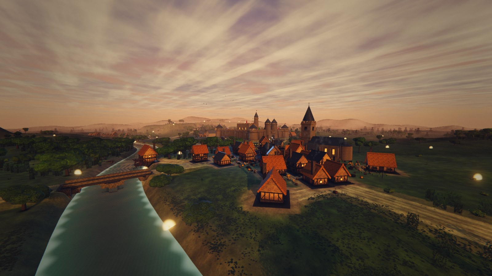
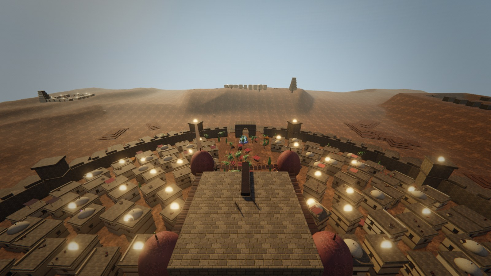
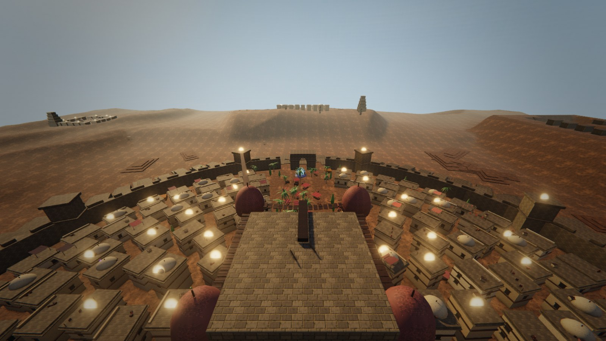

# `orb-hunt`: the white orbs are relic halos

**Branch:** `orb-hunt` · **Scope:** `src/systems/Relics.js`, one word in
`src/systems/Loot.js`, one test, one new probe · **Worlds measured:** `medieval`, `citadel`

Six branches have now looked at the hard white/cream orbs in the aerial and
rooftop framings. `art-medieval` §2.1 and `art-citadel` §1.6 attributed them to
`src/systems/Loot.js`; `art-loot` disproved that with pixels and could not say
what they were. This branch names them.

They are **`relic.glow`** — the halo billboard in **`src/systems/Relics.js`**.

---

## 1. The answer, in one table

Null floor first, because a number without one is not a measurement. The probe
renders with `dt` exactly 0, which makes the film grain reproduce, so two
frames with nothing changed between them are **bit-identical**:

| framing | null pair (whole frame) | orbs with `relics:glow` visible | with it hidden | footprints removed |
| --- | --- | ---: | ---: | ---: |
| `medieval/hills-vista` | peak ΔLum **0.0**, 0 px over 1.0 | **8** | **0** | 6 |
| `citadel/tower-top` | peak ΔLum **0.0**, 0 px over 1.0 | **19** | **0** | **230** |
| `citadel/souk-roofs` | peak ΔLum **0.7**, 0 px over 1.0 | **6** | **0** | **83** |

Hiding one `InstancedMesh` takes every orb out of three framings in two worlds.
The mesh named `relics` (the octahedron body) accounts for almost none of it —
adding it to the ablation moves `hills-vista` from `sumΔLum 1,173,099` to
`1,183,188`, i.e. **the halo is ~99% of the signal and the gem is ~1%**.

**And the orbs are where the relics are.** Every detected orb, matched to the
nearest projected relic instance:

| framing | orbs | worst screen-space miss |
| --- | ---: | ---: |
| `medieval/hills-vista` | 8 | **9.5 px** (six of eight within 3.0 px) |
| `citadel/tower-top` | 19 | **4.5 px** |
| `citadel/souk-roofs` | 6 | 13.2 px |

That is an identification, not a correlation: the ablation removes them and the
projection says which one each was.

| `medieval/hills-vista`, haze off (as five branches saw it) | the same framing with the halo obeying the haze |
| --- | --- |
|  |  |

| `citadel/tower-top`, haze off | haze on — and this world is the one it does not help |
| --- | --- |
|  |  |

---

## 2. Why five branches could not find it

Three independent reasons, each sufficient on its own. All three are properties
of the *instruments*, not of the defect, which is why more looking did not help.

### 2.1 It is not in the world group

`Relics._build` does `this.scene.add(this.glow)`. Both relic meshes are
parented to the **scene**, because they are reused across worlds and cannot
belong to any one world's group.

Every ablation tool in the repository walks the active world's group:

```js
window.GAME.worldManager.active?.group?.traverse(...)   // scripts/world-shot.mjs --ablate
```

Measured: `relic.glow` is **not among the 27 world-group material names in
medieval, nor the 14 in citadel**, and neither mesh is reachable from either
world group. `art-loot`'s "sweep hiding each of the 69 material names in turn"
was hiding 69 names none of which was the culprit. `--ablate` could not have
found this whatever it was pointed at.

`HARNESS.worldTriangles()` and `world-shot`'s material census have the same
scope, so the relic halos have never appeared in any budget table either.

### 2.2 Both meshes are invisible to every raycast in the session

Measured live, in both worlds:

```
glow.boundingSphere = { c: [0,0,0], r: -1 }
```

An **empty** sphere. `InstancedMesh.raycast` (three 0.185.1) does:

```js
if ( this.boundingSphere === null ) this.computeBoundingSphere();   // ONCE, ever
_sphere.copy( this.boundingSphere ).applyMatrix4( matrixWorld );
if ( raycaster.ray.intersectsSphere( _sphere ) === false ) return;  // always false
```

and `computeBoundingSphere` loops `for ( let i = 0; i < count; i ++ )`, so with
`count === 0` it leaves `makeEmpty()`'s radius of −1 — cached for the rest of
the session. `Relics._onWorld` sets `this.mesh.count = 0` and
`this.glow.count = 0` at the top and then dart-casts rays at the world to find
hiding places. **The relic meshes blind themselves to raycasting during their
own placement pass.**

This is exactly `art-loot` §5.2's "raycasts through them terminate on sky or
terrain: no raycastable geometry on the axis". Reproduced here — direct
`intersectObject` on `relics:glow` returns **0 hits** through the centre of an
orb that mesh is demonstrably drawing.

### 2.3 The nearest-object search was ranked in metres

`art-loot` reports "the closest candidate 31–160 m off-axis". The same search,
run here per instance over the whole scene, reproduces that shape — and shows
why it is wrong. Ranked by **metres** off the ray, the winners are the player's
own viewmodel, 10 cm from the lens:

```
@(569,673)
   by METRES: Mesh 0.05m @0.1m | Mesh 0.09m @0.1m | Mesh 0.09m @0.1m
```

Ranked by **angle** — the quantity a screen pixel actually measures — the same
scene, the same ray, the same frame:

```
   by ANGLE : relics#36 3.62mrad (0.29m @80.1m) | relics:glow#36 3.62mrad | SkinnedMesh 86.64mrad
```

A relic 80 m out and 3.6 mrad off the ray is 0.29 m off it, and loses to a
sleeve 5 cm off it at 10 cm range. The probe now prints both rankings, always.

### 2.4 Where the `THREE.Points` lead was wrong

The hypothesis handed to this branch was that a `THREE.Points` object's
**origin** can sit far off-axis while its vertices spread across the world, so
an object-level search would miss it by exactly the reported distance.

The mechanism is real and the diagnosis is wrong on three counts:

- It is an **`InstancedMesh`**, not `Points`. `Portals.js`, `Sword.js`,
  `DockWorld.js`, `MazeWorld.js`, `MedievalWorld.js` and `PlanetWorld.js` — the
  whole grep list — are all cleared.
- `art-loot`'s search did iterate instances, and it would not have helped: the
  relic instance origins are **on** the orbs, within 1.0–9.5 px. The search
  failed on its *ranking metric* (§2.3), not on its granularity.
- The origin-vs-vertex distinction is not what hid it. Being outside the world
  group (§2.1) is, and no amount of per-vertex searching inside
  `worldManager.active.group` would have reached a mesh parented to the scene.

`art-maze`'s "900 mapless `THREE.Points` = hard cream squares" is a real defect
of the same *appearance* in a different world, which is what made the lead
plausible. It is not this one.

---

## 3. What the material was

```js
new THREE.MeshBasicMaterial({
  name: 'relic.glow',
  color: new THREE.Color(3.2, 1.9, 0.7),   // HDR, linear
  map: gTex,                               // the falloff ramp
  transparent: true,
  opacity: 0.9,
  blending: THREE.AdditiveBlending,
  depthWrite: false,
  toneMapped: false,
  fog: false,                              // <- this
})
```

Three properties compound into a hard dot:

1. **`fog: false`.** No aerial perspective at all. A relic 696 m across
   Aldermoor Vale was drawn at exactly the strength of one at 50 m, in a valley
   where every other surface is on a `Fog(86, 880)` ramp.
2. **`glowScale` clamps the quad at `GLOW_MAX × GLOW_SPREAD = 4.42 m`** for
   everything past 46.67 m. Measured: `quad 4.42 m` on every instance beyond
   that range, in both worlds. So a distant relic holds a *constant angular
   size floor* as well as constant brightness.
3. **The core is linear ≈ 2.88** (`3.2 × 0.9` at the ramp's plateau). Every
   bloom threshold in the game is below that except the station's — medieval
   1.30, the base preset 1.80, dock 2.40, station 3.00 — so the core blooms at
   full strength everywhere, and additive-over-background then saturates the
   channels. Measured colour at the core, before any change: `rgb(251,243,222)`
   at 157 m, `rgb(253,246,229)` at 21.8 m — a near-neutral cream at every
   range, from an authored colour whose ratio is 1 : 0.59 : 0.22 warm amber.

### 3.1 `toneMapped: false` does nothing on the shipped path

Worth recording because it looks like the cause and is not, and because
`relic-glow.test.mjs` pins it with the reason *"an HDR halo that is tone mapped
is just a white square"*.

three 0.185.1, `WebGLPrograms.getParameters`:

```js
let toneMapping = NoToneMapping;
if ( material.toneMapped ) {
  if ( currentRenderTarget === null || currentRenderTarget.isXRRenderTarget === true ) {
    toneMapping = renderer.toneMapping;
  }
}
```

In-shader tone mapping is applied **only when rendering to the default
framebuffer**. `PostFX` renders the scene into a HalfFloat `EffectComposer`
target and ACES is applied once, later, by `OutputPass`. So `material.toneMapped`
is ignored for *every* material in the scene pass, and this flag is inert.

It bites on exactly one path: `PostFX._enabled === false` (the low tier, or
after repeated composer failures), where `Engine` falls back to
`renderer.render(scene, camera)` straight to the canvas. There the halo would
clip to a flat white square while everything around it is graded. **Reported,
not changed** — it is a latent defect with its own argument, and changing it
cannot affect the orbs.

---

## 4. The fix, and what it is worth

`relic.glow` now carries the shared additive-haze law.

`fog: true` **alone makes this worse**, which is the trap. Three's stock
`<fog_fragment>` is `mix(colour, fogColor, fogFactor)` — right for a surface
being *veiled*, wrong for an additive quad being *added*: a fully fogged relic
would add haze colour at full strength and paint a **brighter** dot at 880 m
than at 88 m. Emitted light is swallowed by haze, so the patch multiplies by
`1 - fogFactor` instead.

That law already existed. `hazeAdditive` is now **exported from `Loot.js`** and
imported rather than copied, and its cache key is `additive-fog.v1` rather than
`loot.additive-fog.v1`, because one law used by two systems needs one function
object and one key or the program cache splits. `Projectiles.js` and `VFX.js`
carry the same rule by hand in their own shaders.

One detail is different here from the loot case and is worth writing down: the
chunk lands on a **linear** value, not an encoded one, because the scene renders
to a render target (§3.1). So the attenuation is exactly `1 - fogFactor`, not
the `(1 - fogFactor)^2.4` the same chunk gives on a direct-to-canvas draw.

### 4.1 Measured, before and after, in one session

The law is three properties on one material, so it can be taken off and put back
at runtime. Both halves of every A/B below are the **same boot, same relic
placement, same residency, same camera** — the only difference is the law.
Order is ON → OFF → ON, and the third measurement is the control.

**`medieval/hills-vista`** — null pair **0.0**, control (ON vs ON again) peak
**5.9**. So nothing under ~6 lum is claimed.

| relic distance | peak lum before → after | Δ | rgb before → after |
| ---: | --- | ---: | --- |
| 695.9 m | 235.2 → 193.7 | **−41.5** | `251,235,190` → `232,189,127` |
| 655.8 m | 226.7 → 189.9 | **−36.8** | `243,226,186` → `224,186,128` |
| 628.8 m | 235.3 → 200.2 | **−35.1** | `252,235,189` → `232,197,138` |
| 568.6 m | 231.1 → 207.5 | **−23.6** | `250,231,177` → `240,205,136` |
| 455.8 m | 135.8 → 116.5 | **−19.3** | `175,130,78` → `155,110,68` |
| 527.5 m | 116.0 → 97.8 | **−18.2** | `152,110,70` → `130,92,61` |
| 472.8 m | 188.7 → 172.0 | **−16.7** | `217,187,122` → `206,169,102` |

**13 of 57 on-screen relics moved more than the control floor, and every one of
them is beyond 455 m.** Cream becomes amber: the far relics stop being neutral
white dots and start being the warm gold they are authored as.

**Nothing inside the fog's near plane moved at all.** The relic at 56.7 m reads
`rgb(238,229,196)` peak 228.5 before and `rgb(238,229,196)` peak 228.5 after —
identical. That is the property that makes this a conformance fix rather than a
re-author: a pickup at 40 m in Aldermoor Vale is still drawn at full strength,
because the vale's fog starts at 86 m.

`medieval/village-square`: 0 orbs before, 0 after, **0 of 40** relics moving
above the control floor of 4.0. Reported because it is a null result and
because `art-medieval` claimed "one searing blob in the village square" — on
the repaired harness there is none.

---

## 5. What this does NOT fix, and why I stopped

**`medieval/hills-vista` still has 4 orbs after the change, and
`citadel/tower-top` is essentially untouched.**

The reason is arithmetic, not a failed fix. The remaining orbs are relics at
**57, 128.6, 148.6 and 202.9 m**. Aldermoor Vale's fog is `near 86 / far 880`
and three's linear fog is a smoothstep over that span:

| distance | fog factor | attenuation |
| ---: | ---: | ---: |
| 57 m | 0.000 | none, by design |
| 128.6 m | 0.008 | 0.8% |
| 202.9 m | 0.030 | 3% |
| 628.8 m | 0.765 | 76% |

Citadel is worse for this, and the A/B says so plainly. Its fog is
`near 78 / far 880`, its relics run **39–501.8 m** with the great majority on
rooftops inside 160 m, and the measured result in `tower-top` is:

| | |
| --- | --- |
| null pair (whole frame) | peak ΔLum **0.0** |
| control (ON vs ON again) | peak ΔLum **28.1** |
| orbs before → after | **18 → 17** |
| relics moving more than the control floor | **0 of 51** |

Two things to read off that. First, **the fix is worth nothing measurable in
citadel** — the one-orb difference is far inside the noise. Second, that
framing's noise floor is 28.1 lum against medieval's 5.9, because `tower-top`
is a `computed: true` framing that teleports the player and waits on residency,
so it cannot resolve a small change even in principle. It is reported rather
than quietly dropped, and no claim in this document rests on it.

So in the world where `art-citadel` called the orbs "by some distance the
loudest thing in `tower-top`", this branch identifies them and does **not**
quiet them.

What is left is the **radiance** defect of §3 item 3: a 4.42 m additive quad at
linear 2.88 over a bloom threshold of 1.30–1.80, which saturates to cream at any
range where fog cannot help. It is the same defect `art-loot` fixed in `Loot.js`
§3.1 by cutting the intensity budget until the kind colour survived ACES.

**I am handing that back rather than taking it**, for the reason the brief gives:
it is a judgement call about a shared system. Cutting a relic's radiance trades
*discoverability of a collectible at range* for *colour fidelity*, and
`Relics.js`'s own header says the whole design intent is "a reason to keep your
eyes up while you travel". That is a game-design decision, not a rendering one,
and it should be made by whoever owns that intent. The fog change needed no such
trade: it applies the law the world already applies to everything else and
leaves the near field pixel-identical.

**The recommendation, with the numbers already taken.** Scale the authored
colour down while holding its hue ratio — `Color(3.2, 1.9, 0.7)` is
1 : 0.59 : 0.22, and the core needs to land near the bloom threshold rather than
2.2× over it. `art-loot`'s shape is the model: one lever, one invariant a test
can hold. A sensible invariant here is `max(color) × opacity ≤ 1.6`, matching
the coincident-sum ceiling that file already pins.

### 5.1 Half the "dozen" was the harness

`art-medieval` reported "a dozen scattered across the vale in `hills-vista`".
Measured on the old `Harness.ready()`, `hills-vista` showed **8** detected orbs.
On the repaired one — which no longer returns while `prewarm()` is still running,
and so no longer photographs the world inside `rehearse()`'s `forceDrawable` —
the same framing shows **4**.

So the sibling `harness-instruments` hypothesis is **partly right**: some of the
orb population in the old reports was the harness holding objects visible
mid-warm. It does not touch the attribution — the ablation that removes them is
within a single frame, the relic meshes are outside the world group that
`forceDrawable` operates on, and the surviving orbs respond to a fog law exactly
as their distances predict — but it does mean **the orb counts in every report
before this one are inflated**, this branch's own first run included.

---

## 6. The gate, and the ablation proving it bites

`scripts/tests/relic-glow.test.mjs` (existing file, extended). Two assertions
were **replaced rather than deleted**, and the replacement is strictly stronger.

The file used to assert the halo material patches no shader at all:

```js
assert.equal(mat.onBeforeCompile, stock.onBeforeCompile);
assert.equal(mat.customProgramCacheKey(), stock.customProgramCacheKey());
```

with the reason that writing the *falloff ramp* in GLSL would fork a program.
That reason still stands and the ramp is still a texture. But "stock" would also
pass for a **private copy** of the haze law, which is the thing that actually
costs a program. So the claim is now "it is THE SHARED ONE":

```js
const shared = hazeAdditive(new THREE.MeshBasicMaterial());
assert.equal(mat.onBeforeCompile, shared.onBeforeCompile);
assert.equal(mat.customProgramCacheKey(), shared.customProgramCacheKey());
```

plus the law itself, run against a stub shader, because a `fog: true` flag
assertion cannot tell the good fix from the trap:

```js
assert.ok(!/mix\s*\(/.test(stub.fragmentShader));           // not mixing to fogColor
assert.match(stub.fragmentShader, /\*=\s*1\.0\s*-\s*fogFactor/);   // multiplying down
```

**Proved by ablating the fix three ways.** All three fail; the real fix passes
7 of 7:

| what was done to `Relics.js` | result |
| --- | --- |
| fix removed entirely (`fog: false`, no patch) | **fails** — "the halo opts out of the scene fog" |
| naive `fog: true`, no haze patch — *the trap* | **fails** — "the halo MIXES toward fogColor" |
| a **private** copy of the correct law, own cache key | **fails** — "the halo has its OWN haze patch closure" |

---

## 7. The instrument

`scripts/pixel-attribution/`, committed rather than left in `.probe/` for the
reason `world-shot.mjs`'s own header gives about tools that die with a worktree.
Its README carries the method; the three properties that make it trustworthy:

1. **The ablation and the pixels that judge it are in one JavaScript task** —
   `hide → postfx.render(0) → gl.readPixels → restore`, synchronously, so the
   rAF loop cannot slip a frame in between.
2. **`dt` is exactly 0**, so the film grain reproduces and the null pair is
   *zero* rather than merely small. Every figure above is printed with its local
   null beside it.
3. **Leaves only, never a `Group`** — hiding a group can hide a light, which
   re-keys every shader program in the scene.

`sweep.mjs` is the part that actually found this: it catalogues every visible
renderable leaf **in the whole scene** (798 in medieval), hides each in turn,
and reports which screen regions moved. It needed no hypothesis, and it ran in
**13.5 s**.

---

## 8. Files

| file | change |
| --- | --- |
| `src/systems/Relics.js` | `relic.glow` takes `hazeAdditive`; `fog: false` removed; the measurements and the `toneMapped` finding in comments. |
| `src/systems/Loot.js` | `hazeAdditive` exported; cache key renamed `loot.additive-fog.v1` → `additive-fog.v1`. No behaviour change. |
| `scripts/tests/relic-glow.test.mjs` | two assertions strengthened, three added. |
| `scripts/pixel-attribution/**` | new: the scene-wide attribution probe and its README. |
| `docs/superpowers/specs/2026-08-23-art-medieval-design.md` | §2.1 corrected. |
| `docs/superpowers/specs/2026-08-23-art-citadel-design.md` | §1.6 corrected. |
| `docs/superpowers/specs/img/2026-08-23-orb-hunt/*.json` | the raw measurements behind every table above. |

## 9. Handed back, not done

1. **The radiance half of the orbs** (§5) — the judgement call, with numbers.
2. **`toneMapped: false`** on `relic.glow` (§3.1) — inert today, a white square
   if `PostFX` ever falls back.
3. **The empty bounding sphere** (§2.2) — both relic meshes are unraycastable
   for the whole session. Repairing it would make a *halo* raycastable, which
   could put an additive billboard in front of a projectile or a camera probe,
   so it wants a decision about `raycast` on the glow rather than a one-line
   recompute.
4. **`--ablate`'s scope** — `scripts/world-shot.mjs` is owned by
   `harness-instruments`. Its traversal starts at `worldManager.active.group`
   and so cannot see `Loot`, `Relics`, `VFX`, `Projectiles` or the viewmodel.
   That is the single reason this defect survived five branches, and it is a
   one-line change in a file this branch must not touch.
